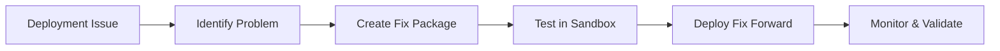

# Salesforce Rollback Limitations: A Deep Dive

## 🎯 Executive Summary

**Rollbacks in Salesforce are fundamentally different from traditional software deployment rollbacks.** In fact, true rollbacks are often impossible due to the nature of Salesforce's metadata architecture and platform constraints. This document explains why and provides alternative strategies.

## 🧠 Understanding the "Metadata Happy Soup" Problem

### Traditional Rollback (e.g., Git)
```
State A → Deploy → State B → Rollback → State A (exact restoration)
```

### Salesforce Reality
```
State A (with metadata M1, M2, M3)
    ↓ Deploy
State B (with metadata M1', M2', M3', M4, M5)
    ↓ "Rollback"
State C (M1, M2, M3 restored, BUT M4 and M5 still exist!)
```

**Key Insight:** Salesforce is not a blank slate. It's a "happy soup" of metadata where:
- The target environment already contains metadata
- New deployments must coexist with existing metadata
- You cannot simply "replace" the environment state
- Many operations are additive and irreversible

## ❌ Impossible Rollback Scenarios

### 1. Deleting Custom Fields with Data

**Scenario:**
```xml
<!-- Deployment removes a custom field -->
<members>Account.CustomField__c</members>
```

**Why rollback fails:**
- ❌ The field's data is permanently lost when deleted
- ❌ Recreating the field structure doesn't restore the data
- ❌ Data loader backups would be needed (outside metadata scope)

**Impact:** **Data loss is permanent**

---

### 2. Creating New Custom Fields

**Scenario:**
```xml
<!-- Deployment adds a new field -->
<CustomField>
    <fullName>NewField__c</fullName>
    <type>Text</type>
</CustomField>
```

**Why rollback fails:**
- ❌ Deploying the "old" package.xml doesn't delete the new field
- ❌ You need a destructive changes package (which this tool attempts)
- ❌ If data exists in the field, deletion requires manual cleanup
- ❌ Field history, workflows, and dependencies must be cleaned first

**Impact:** New metadata persists unless explicitly destroyed

---

### 3. Profile Permission Changes

**Scenario:**
```xml
<!-- Deployment grants new permissions -->
<userPermissions>
    <enabled>true</enabled>
    <name>ViewAllData</name>
</userPermissions>
```

**Why rollback fails:**
- ❌ Deploying old profile metadata doesn't revoke permissions that were granted
- ❌ Permission sets and muting permissions add complexity
- ❌ Users may have taken actions with the elevated permissions
- ❌ Audit trail doesn't support "permission reversal"

**Impact:** Security implications - permissions granted cannot be ungranted reliably

---

### 4. Sharing Rules Modifications

**Scenario:**
- Public Group membership changes
- Criteria-based sharing rule additions
- Manual sharing grants triggered by automation

**Why rollback fails:**
- ❌ Previous sharing rule versions don't undo new access patterns
- ❌ Users may have already accessed data they shouldn't
- ❌ Sharing recalculation is asynchronous and can take hours
- ❌ Manual shares created during the "elevated access" period persist

**Impact:** Data exposure cannot be retroactively prevented

---

### 5. Picklist Value Additions

**Scenario:**
```xml
<!-- New picklist value added -->
<values>
    <fullName>NewValue</fullName>
    <default>false</default>
</values>
```

**Why rollback fails:**
- ❌ Cannot delete picklist values that are in use by records
- ❌ Requires manual data cleanup before value can be removed
- ❌ Process builders, flows, and validation rules may reference the value
- ❌ Reports and dashboards filter on the value

**Impact:** Must keep the value or perform extensive manual cleanup

---

### 6. Translation Changes

**Scenario:**
- Custom labels updated
- Field labels translated
- Help text modified in multiple languages

**Why rollback fails:**
- ❌ Language-specific metadata changes persist independently
- ❌ Translation workbenches and third-party tools add complexity
- ❌ Users in different locales see different states
- ❌ Caching can cause inconsistent views

**Impact:** Inconsistent user experience across languages

---

### 7. Industries/Communications Cloud

**Scenario:**
- OmniStudio components (FlexCards, OmniScripts, Integration Procedures)
- Vlocity/Industries datapacks
- Industry-specific objects and configurations

**Why rollback fails:**
- ❌ **Significantly more complexity and corner cases**
- ❌ Mix of metadata and datapacks makes atomic deployments impossible
- ❌ Dependencies between metadata and data are tightly coupled
- ❌ Activation/deactivation states are not captured in metadata
- ❌ Runtime configurations stored in custom objects
- ❌ Version management is more complex

**Impact:** Industries Cloud rollbacks are **virtually impossible** with standard tools

---

### 8. Additional Impossible Scenarios

| Scenario | Why Rollback Fails | Recommendation |
|----------|-------------------|----------------|
| **Custom Objects with Data** | Cannot delete objects with records | Deactivate, don't delete |
| **Workflows/Process Builders** | May have already executed actions | Deactivate and create compensating logic |
| **Validation Rules** | Data created during "relaxed" rules | May fail validation when reactivated |
| **Formula Fields** | Historic calculations lost | Cannot recalculate past values |
| **Record Types** | Records assigned to new types | Cannot reassign without data cleanup |
| **Page Layouts** | User customizations may conflict | Need manual review and adjustment |
| **Lightning Pages** | Users may have customized | Cannot force user preferences to revert |
| **Connected Apps** | OAuth tokens and sessions | Cannot revoke established connections |

## 🔄 The Reality: Compensatory Rollback

### What This Plugin Actually Does

This tool creates **compensatory packages** that:

1. ✅ Deploy previous versions of changed metadata
2. ✅ Generate destructive changes for newly added components
3. ✅ Provide a structured approach to "rolling forward" with old metadata

### What This Plugin CANNOT Do

1. ❌ Restore deleted data
2. ❌ Undo user actions taken during the deployment window
3. ❌ Reverse permission grants that allowed data access
4. ❌ Remove metadata that has dependencies or data
5. ❌ Guarantee 100% return to previous state

## 🎯 Recommended Approach: Roll Forward, Not Rollback

### Why Roll Forward?

**Roll forward** means creating new deployments that fix issues, rather than trying to reverse changes.

```
Problem Deployment → Forward Fix Deployment → Resolved State
```

### Advantages of Roll Forward

1. ✅ **Transparency** - All changes are documented and tracked
2. ✅ **No Data Loss** - You're not deleting anything
3. ✅ **Testable** - You can test the fix in sandbox
4. ✅ **Auditable** - Clear trail of what went wrong and how it was fixed
5. ✅ **Safer** - Less likely to cause cascading failures

### Roll Forward Strategy



## 🛡️ Better Than Rollback: Prevention

### Invest in Pipeline Quality

#### 1. Automated Testing
```yaml
# Example CI/CD Pipeline
stages:
  - validate
  - test
  - deploy

validate:
  script:
    - sf project validate --target-org sandbox
    - sf scanner run --target src/

test:
  script:
    - sf apex test run --test-level RunLocalTests
    - npm run test:integration

deploy:
  script:
    - sf backup create --target-org prod  # Use this plugin!
    - sf builds deploy --target-org prod
  when: manual
```

#### 2. Nightly Builds
- Run full deployments to integration environments nightly
- Catch issues before they reach production
- Maintain deployment readiness

#### 3. Comprehensive Unit Tests
- Target 85%+ code coverage (not just Salesforce minimum)
- Test edge cases and error conditions
- Mock external dependencies

#### 4. Sandbox Testing
- Use full sandbox copies for major releases
- Test on realistic data volumes
- Include user acceptance testing (UAT)

### Multi-Layer Backup Strategy

Don't rely solely on this plugin:

1. **Salesforce Backup** - Weekly full backup service
2. **This Plugin** - Pre-deployment metadata backup
3. **Git** - Source of truth for code
4. **Change Sets/Packages** - Alternative deployment tracking
5. **Documentation** - Manual runbooks for critical processes

## 📋 When You Must "Rollback"

If you absolutely must attempt a rollback:

### Before You Start

- [ ] **Review the generated rollback package manually**
- [ ] **Test the rollback in a sandbox first**
- [ ] **Document what changed and why you're rolling back**
- [ ] **Identify what CANNOT be rolled back from the list above**
- [ ] **Have a roll-forward fix plan ready as backup**
- [ ] **Get stakeholder approval**

### Rollback Execution

1. **Deploy to Sandbox First**
   ```bash
   sf backup rollback --backup-dir backups/backup_xxx --target-org sandbox
   ```

2. **Validate Results**
   - Check all affected metadata
   - Test critical business processes
   - Review error logs

3. **Deploy to Production (if sandbox succeeds)**
   ```bash
   sf backup rollback --backup-dir backups/backup_xxx --target-org prod
   ```

4. **Monitor Closely**
   - Watch deployment logs in real-time
   - Have support team ready
   - Monitor user reports

### After Rollback

- [ ] **Verify all critical functionality**
- [ ] **Document the rollback in your change log**
- [ ] **Perform data validation checks**
- [ ] **Identify what couldn't be rolled back**
- [ ] **Create tickets for manual cleanup tasks**
- [ ] **Conduct post-mortem to prevent future issues**

## 🎓 Key Takeaways

1. **Rollbacks in Salesforce ≠ Rollbacks in Traditional Software**
   - Treat them as compensatory forward deployments
   - Understand the limitations before relying on them

2. **Many Rollback Scenarios Are Impossible**
   - Data loss cannot be recovered
   - Permission grants cannot be fully reversed
   - New metadata persists unless explicitly destroyed

3. **Prevention > Rollback**
   - Invest in testing and validation
   - Use sandbox environments extensively
   - Implement comprehensive CI/CD pipelines

4. **Roll Forward When Possible**
   - Safer and more transparent
   - Better auditability
   - Easier to test and validate

5. **Use This Plugin As Part of a Broader Strategy**
   - Not a silver bullet
   - Combine with other backup methods
   - Always test in sandbox first

## 📚 Additional Resources

- [Salesforce Metadata API Developer Guide](https://developer.salesforce.com/docs/atlas.en-us.api_meta.meta/api_meta/)
- [Salesforce DX Developer Guide](https://developer.salesforce.com/docs/atlas.en-us.sfdx_dev.meta/sfdx_dev/)
- [sf-orgdevmode-builds Plugin](https://github.com/tiagonnascimento/sf-orgdevmode-builds)
- [Salesforce Well-Architected: Change Management](https://architect.salesforce.com/well-architected/security/change-management)

---

**Remember:** This plugin is a tool to help with simple metadata reversions. It is NOT a guarantee of successful rollback. Always test, always have a plan B, and when possible, fix forward instead of rolling back.

